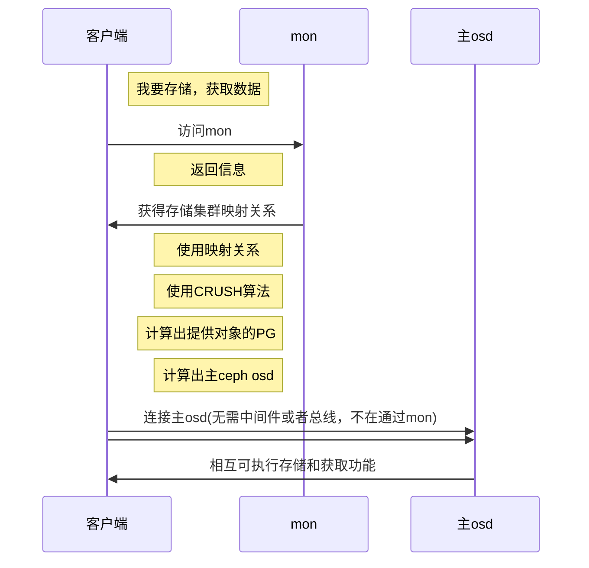

# 降智理解ceph存储架构

## 一、概览

​	ceph是一种开源存储平台，能够提供分布式存储的服务。

> 开放源代码，github上有[项目](https://github.com/ceph/ceph)，[分布式存储](./分布式存储.md) 是存储的未来，更适应非结构化数据
>
> 结构化数据：
>
> ​	数据库，等可以通过赋予逻辑的数据，二维表之类的
>
> 非结构化数据：
>
> ​	图片、音频、文档等，数据本身不具备逻辑性，对于计算机非结构化数据更难理解

​	设计目标为：

1. 在性能上(影响因素：硬盘性能和总数-主，网络性能-主，内存，CPU) 

   > 故性能测试主要测试前两项

2. 可靠性上(表现：分布式存储提供了，防止单点故障导致的整体崩溃)

3. 可扩展性上(表现：以千为单位的客户端访问EB级以上的数据)		

   > KB<MB<GB<TB<PB<EB<YB

接口丰富：  不同的存储针对的本质目标是使用数据的 '使用者'

### 块存储：主要针对 可以支持读取  块设备 的软件系统

> 这是一种很传统的文件系统，一般用于直接访问存储数据的硬件介质。
>
> 介质不需要考虑这些数据的组织方式和结构，而是采用简单的按照大小分块，并编号的处理方式
>
> 一种类似于磁盘的扇区的用法，自身也不考虑上下层结构和文件需要那些块组成，而是交给文件系统进行处理。

### 文件存储：主要使用者是 '自然人'

> 无论是程序还是数据，存储在机器中的01组合，不在人类的理解工作内容，所以统称为文件。
>
> 通常情况下，文件按照应用程序所需要的组成机构组成不同类型的文件，以及使用一些后缀来方便区分记忆
>
> 或者划分文件分组，使用目录（文件夹进行存储）
>
> 一般会使用一个文件系统，对这些内容进行管理，比如相对地址绝对地址这些内容
>
> 常见的文件系统有：windows的FAT/FAT32/NTFS、Linux的EXT2/EXT3/EXT4/XFS 等等
>
> 特殊的文件系统：FTP、HTTP 等   支持使用URL 来进行一个文件的访问

### 对象存储：主要针对 '使用者' 是其他计算机软件

> 对象存储介于上述块存储和文件存储之间。文件存储的结构关系虽然方便了'自然人'的管理，访问
>
> 但是在计算机中，则会显的浪费性能。 而对于块存储，存储内容，会具有排他的特性，阻止其他客户端访问被访问的逻辑块  
>
> 为了解决上述问题，需要使用统一的存储系统，将块的文件和组织结构进行标识，高效的通过标识进行访问的控制
>
> 在实际情况中，一次访问放到的实际情况可能是文件的一部分或者是多个文件的组合甚至是块设备，所以统称为对象

​	ceph实现了分布式对象存储-BlueStore

ceph的软件库为客户端应用提供了可靠的 自主式分布式对象存储（RADOS）基于对象的存储系统直接进行访问

并提供了一些功能：块设备（RBD） RADOS Gateway ...

​	图中librados 软件库  提供了 C、C++、PHP、Python，进行本地的接口绑定使用

​    RADOS网关还将对象存储公开为RESTful接口，作为本地Amazon S3 和 openstack Switf API呈现

> [Amazon S3](https://en.wikipedia.org/wiki/Amazon_S3):亚马逊提供的一项服务，通过Web服务界面提供对象存储
>
> [Openstack Switf](https://en.wikipedia.org/wiki/OpenStack#Object_storage_(Swift)):开源云计算项目的存储组件

### ceph的五种进程

#### 集群监视器(ceph-mon)-主

​	跟踪活动和失败的集群节点，集群配置和有关数据放置全局群集状态的信息,从而映射一份关系的主副本

#### 对象存储设备（ceph-osd）-主

​	为ceph客户端存储数据提供支持。利用节点上的cpu和内存执行 数据复制、数据在平衡、数据恢复、状态上报的功能

#### 元数据服务器（ceph-mds）

​	用于缓存和代理对CephFS文件系统内inode和目录的访问

#### HTTP网关（ceph-rgw）

​	独立于存储层，提供兼容Amazon S3 和 openstack Switf API的http接口

#### 集群管理器 （ceph-mgr）

​	执行集群监视、记录和维护任务，并提供外部接口；

​			比如：[balancer](https://balancer.finance/)，dashboard(仪表盘功能) ，[Prometheus](https://en.wikipedia.org/wiki/Prometheus_(software)) (监视警报)，[Zabbix](https://www.zabbix.com/) 插件

### ceph客户端

​	ceph提供客户端接口来进行ceph存储集群数据的读写交互，使用客户端仅需提供下述条件：

+ ceph配置文件（/etc/ceph.conf文件）,或者 集群名称+mon监视节点地址
+ 存储池的具体名称
+ 用户名以及密钥所在路径（/etc/ceph.client.admin.keyrong）

ceph客户端相对独立，可以维护对象ID和存储对象的存储池名称，但是不需要维护osd（对象存储设备节点）的索引，也不需要参与具体对象索引进行查找数据的位置。就是说管事但是不参与具体干活。

### 具体客户端访问流程：

> 当一个OSD存储对象时，无论客户端是上述任何接口，存储的每一个对象相当于文件系统中存储在存储设备上的一个文件
>
> 当然每个对象的ID，在整个集群中都是唯一的。

​		ceph osd存储数据后，会将所有数据作为对象存储在一个扁平结构的命名空间中，也就是说没有层次结构，数据不存在上下层（包含等）关系。所有对象在整个集群范围内具有唯一的ID标识（类似于身份证），二进制数据（本身），一些名称和值组成的元数据（简单介绍）

> 上述三项内容组成的对象可以表示对象的  结构化  或者  非结构化 （这里的概念上面有介绍），以及数据存储的接口。

## 二、存储集群架构

## 三、客户端架构

## 四、加密

https://mp.weixin.qq.com/s?__biz=MzAxNzU3NjcxOA==&mid=2650728120&idx=2&sn=fe30779aac535ffccf07cdfdfcff719f&chksm=83e920d9b49ea9cfa28411c685541ee3bb40b7f558f994ef287ea8072ca5fc000650643c0db2&mpshare=1&scene=1&srcid=0126xZnjArdYEz5xd4CjZatp&sharer_sharetime=1611672905348&sharer_shareid=55b53067d0ac114509f8a7f572cbf4f5&version=3.1.1.3001&platform=win#rd